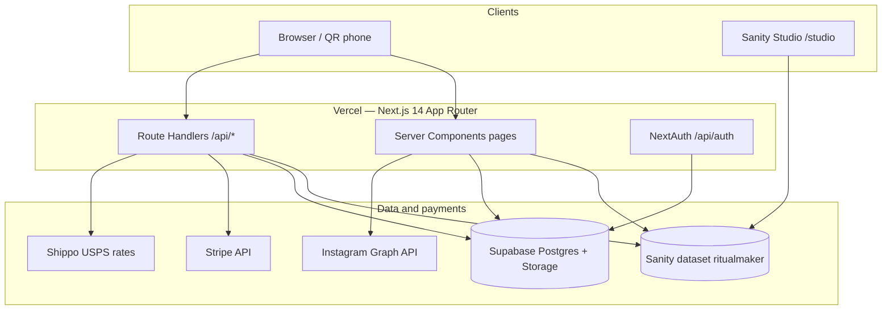

# Ritualmaker — Architecture Map

Companion to [`00_SYSTEM_INDEX.md`](./00_SYSTEM_INDEX.md). Runtime shape as of **2026-05-20**.

---

## High-level diagram

---

## Data ownership split

| Concern | Sanity | Supabase |
|---------|--------|----------|
| Site copy, FAQs, reviews, archive photos | yes | — |
| Catalog: bouquets, pantry, flower products | yes | vendors (Connect) |
| Inquiries (wedding / on-location) | yes | — |
| UX analytics | yes (`uxEvent`) | — |
| **Client proposals / invoices** | legacy `eventOrder` (dashboard only) | **`client_documents` canonical** |
| Vendor sign-in | mirrored | `vendors` |

---

## Public routes

| Path | Notes |
|------|--------|
| `/` | Home |
| `/farm-stand`, `/farm-stand/product/[slug]` | Shop |
| `/photography` | Portfolio |
| `/on-location` | Live Collage™, inquiries |
| `/proposal/[token]` | Hosted proposal, noindex |
| `/checkout/success`, `/cancel` | Post-Stripe |
| `/studio` | Sanity Studio |
| `/shop`, `/weddings`, … | `next.config.mjs` redirects |

---

## Admin routes

| Path | Audience | Backend |
|------|----------|---------|
| `/admin/sign-in` | owner + vendors | NextAuth |
| `/admin/(portal)/*` | dashboard, products, orders | Sanity |
| `/admin/events/*` | owner only | Supabase CRM |

---

## Key modules

| Path | Role |
|------|------|
| `src/lib/db.ts` | Supabase helpers |
| `src/lib/stripe.ts` | Stripe client |
| `src/lib/clientDocument*.ts` | Proposal payloads / payments |
| `src/sanity/` | CMS schemas and queries |
| `src/auth.ts` | Credentials auth |

---

## Deployment

- **Vercel** — `ritualmakerny.com` (cutover pending)
- **Build** — `pnpm build` needs Sanity env; `pnpm check` local compile-only
- **DB** — `supabase db push` for migrations
