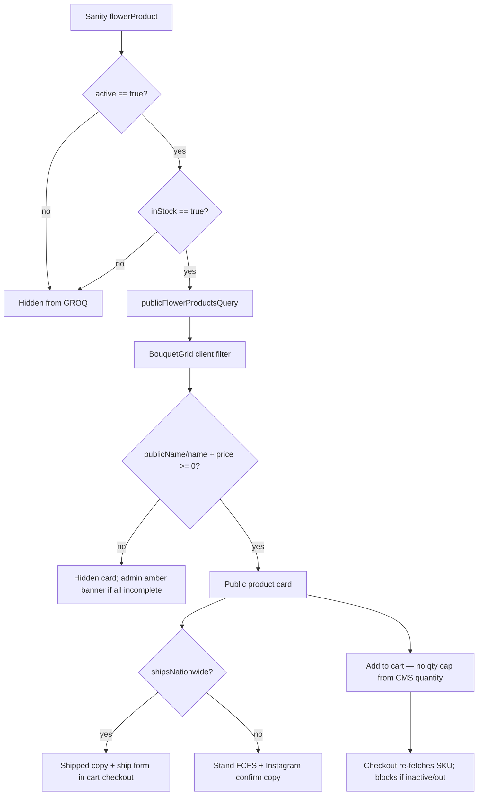

# Ritualmaker — Inventory Truth Audit 01

**Date:** 2026-05-27  
**Mode:** Read-only audit (no product code, no Sanity mutations, no checkout/payment changes)  
**Repo:** alenephotographs/Ritualmaker  
**Purpose:** Assess whether the storefront/product system honestly reflects Ritualmaker’s seasonal operating model — garden production, stand inventory, cash/direct sales, website checkout, shipped pantry/flower items, bloom timing, perishability, and founder labor.

---

## RC summary

The canonical sellable SKU is **`flowerProduct`** in Sanity. The public shop at `/farm-stand` loads only rows where `active == true` and `inStock == true`, then the client further filters to cards with a title and valid price. **`quantity`, `recurringItem`, and `internalNotes` do not affect storefront visibility or checkout.** **`shipsNationwide`** controls shipping UX and checkout address collection, not whether a product appears.

**Stand season truth** lives in `siteSettings.standStatus` (open / restocking / closed) and affects header CTA copy only — it does **not** hide products, block checkout, or sync with `inStock`. **`quantity` is optional admin metadata with no enforcement path.**

**Highest drift risks:** (1) `inStock` and `active` are manual booleans with no link to blooms, shelf count, or sales; (2) website and cash sales do not decrement inventory; (3) hero/JSON-LD imply 24/7 availability while stand can be season-closed; (4) public cards can render without images (admin save requires images, storefront does not); (5) legacy `bouquet` / `pantryItem` types and checkout paths still exist but the live shop passes `bouquets={[]}`.

**Honest today if:** founder manually toggles `inStock` / `active`, updates `standStatus` in Sanity Studio, and treats `quantity` as a notebook — not as system truth.

**Smallest safe next step (Gear 1):** adopt a manual pre-open / pre-list checklist tied to Sanity fields (documented in Gear 1 queue below). **Do not automate checkout or inventory sync yet.**

### Source-truth reconciliation note (2026-05-27)

Initial audit pass ran against a local checkout **5 commits behind `origin/main`**. Files marked **Unavailable** below were absent locally but **present on remote** after `git pull --ff-only origin main`. Audit code findings stand; use these remote docs for broader operating context (not duplicated here):

- `docs/operations/ritualmaker-seed-tracking-database-v0-1.md`
- `docs/internal/RITUALMAKER_OPERATING_SPHERE.md`
- `docs/internal/RITUALMAKER_NEXT_SAFE_ACTION_QUEUE.md`
- `docs/internal/RITUALMAKER_SPHERE_MAP.json`

---

## Files read

| File | Status |
|------|--------|
| `README.md` | Read |
| `docs/cutover.md` | Read |
| `docs/operations/ritualmaker-seed-tracking-database-v0-1.md` | **Unavailable** |
| `docs/internal/RITUALMAKER_OPERATING_SPHERE.md` | **Unavailable** |
| `docs/internal/RITUALMAKER_NEXT_SAFE_ACTION_QUEUE.md` | **Unavailable** |
| `docs/internal/RITUALMAKER_WORKLOG.md` | **Unavailable** (created by this pass) |
| `docs/internal/RITUALMAKER_SPHERE_MAP.json` | **Unavailable** |
| `src/app/page.tsx` | Read |
| `src/app/farm-stand/page.tsx` | Read |
| `src/app/farm-stand/product/[slug]/page.tsx` | Read |
| `src/components/Hero.tsx` | Read |
| `src/components/StandStatus.tsx` | Read |
| `src/components/BouquetGrid.tsx` | Read |
| `src/components/Header.tsx` / `HeaderClient.tsx` | Read |
| `src/sanity/queries.ts` | Read |
| `src/sanity/schemas/flowerProduct.ts` | Read |
| `src/sanity/schemas/flowerSalesRecord.ts` | Read |
| `src/sanity/schemas/siteSettings.ts` | Read |
| `src/sanity/schemas/bouquet.ts` | Read |
| `src/sanity/schemas/pantryItem.ts` | Read |
| `src/lib/shopProduct.ts` | Read |
| `src/lib/requiredOfferings.ts` | Read |
| `src/lib/ritualBundle.ts` | Read |
| `src/lib/adminData.ts` | Read |
| `src/app/api/checkout/route.ts` | Read |
| `src/app/api/stripe/webhook/route.ts` (sales record section) | Read |
| `src/app/api/admin/flower-products/route.ts` | Read |
| `src/app/api/admin/sales-records/route.ts` | Read |
| `src/app/admin/(portal)/products/page.tsx` | Read |
| `src/app/admin/(portal)/dashboard/page.tsx` | Read |
| `src/components/AdminDashboard.tsx` (products, dashboard quick stock, orders, settings) | Read |

---

## Unavailable files

- `docs/operations/ritualmaker-seed-tracking-database-v0-1.md`
- `docs/internal/RITUALMAKER_OPERATING_SPHERE.md`
- `docs/internal/RITUALMAKER_NEXT_SAFE_ACTION_QUEUE.md`
- `docs/internal/RITUALMAKER_WORKLOG.md` (prior version — created fresh this pass)
- `docs/internal/RITUALMAKER_SPHERE_MAP.json`

No `docs/internal/` tree existed before this audit.

---

## Product truth model map

Canonical type: **`flowerProduct`** (`src/sanity/schemas/flowerProduct.ts`). Legacy parallel types **`bouquet`** and **`pantryItem`** remain in schema and `/api/checkout` but are **not** loaded on `/farm-stand` (`bouquets={[]}`).

| Field | Stored | Affects public query | Affects card render | Affects checkout | Operational meaning today |
|-------|--------|---------------------|---------------------|------------------|---------------------------|
| `active` | Sanity boolean, default true | **Yes** — GROQ requires `active == true` | Indirect (excluded if false) | **Yes** — 409 if false | Manual “listed / unlisted” switch |
| `inStock` | Sanity boolean, default true | **Yes** — GROQ requires `inStock == true` | Indirect | **Yes** — 409 if false | Manual “available now” — **not** tied to shelf count or blooms |
| `quantity` | Optional number | No | No | No | Admin notebook only; quick-stock table on dashboard |
| `recurringItem` | Boolean, default true | No | No | No | Informational; dashboard counts “out recurring” when `inStock === false` |
| `shipsNationwide` | Boolean, default false | No | **Yes** — “Ships within the US” vs “Stand · FCFS” copy | **Yes** — Shippo shipping vs pickup address collection | Fulfillment mode, not visibility |
| `priceCents` | Required number | No (filtered client-side) | **Yes** — `isShopPublicCardComplete` | **Yes** | Price truth for Stripe inline or linked price ID |
| `publicName` | Required in schema | No | **Yes** — display title (falls back to `name`) | **Yes** — checkout line item name | Customer-facing name |
| `name` | Internal name | No | Fallback title | Fallback checkout name | Admin / Studio label |
| `category` | `flowers` \| `pantry` (+ legacy values) | No | **Yes** — Flowers vs Pantry sections/filters | **Yes** — bundle discount eligibility | Merchandising grouping |
| `gallery` / `imageUrl` / fallbacks | Images | No | **No** — cards render with gradient if missing | Optional Stripe images | Admin **save** requires image; **storefront does not** |
| `internalNotes` | Text | No | No | No | Founder-only notes |
| `stripeProductId` / `stripePriceId` | Optional strings | No | No | **Yes** — uses pre-created price when set | Billing/analytics; optional |
| `inventoryAudit` / `inventoryAuditHistory` | Written by admin API | Queried in admin | No | No | **Not declared on `flowerProduct` schema** — API writes on patch; bouquet/pantryItem schemas have these fields |
| `sortOrder` | Number | No | Order only | No | Display order |

**Legacy `bouquet.available`** and **`pantryItem.available`** mirror `inStock` for old QR/checkout paths but are disconnected from the live `flowerProduct` shop.

**Seed presets:** `src/lib/requiredOfferings.ts` defines Glimmer, Blessing, Abundance (flowers) and Botanical Sugar, Herbal Tea, Garden Oil (pantry, `shipsNationwide: true`). Owner dashboard load calls `ensureRequiredOfferings()` — creates missing docs only; does **not** overwrite stock/price on existing rows; may set `shipsNationwide: true` on canonical pantry SKUs.

---

## Storefront visibility rules

| State | Mechanism |
|-------|-----------|
| **Visible** | `active && inStock` in GROQ + complete title/price on client |
| **Hidden** | `active === false` or `inStock === false` |
| **Incomplete** | In GROQ result but missing title or price — hidden with dev/admin messaging |
| **Purchasable (web)** | Visible + checkout pass (still no `quantity` gate) |
| **Shipped** | `shipsNationwide === true` — Shippo rate + address required for all-shipped carts |
| **Local / stand-only** | `shipsNationwide !== true` — FCFS language; checkout may still collect US address for mixed/non-shipped legacy behavior |
| **Misleading** | Card can show without photo; `inStock: true` while stand closed; cache up to 60s stale (`revalidate = 60`) |
| **Stand closed UX** | `siteSettings.standStatus === "closed"` → header “Stand closed” only; **shop still lists in-stock products** |
| **Product detail** | `/farm-stand/product/[slug]` — 404 if `active === false` or `inStock === false` |

**Stand status pill** (`StandStatus` on home + farm-stand): displays `standStatus` + `standMessage` from Sanity; does not gate the product grid.

---

## Seasonal drift risks

| Drift vector | What can go wrong | Severity |
|--------------|-------------------|----------|
| Manual `inStock` | Blooms not ready but SKU still purchasable online | **High** (flowers) |
| Manual `inStock` | Shelf empty after stand sales; website still sells | **High** |
| `quantity` unused | Founder tracks count in admin but checkout ignores it | **Medium** |
| No sale → stock sync | Stripe webhook creates `flowerSalesRecord` only; no patch to product | **High** |
| Manual cash sales | Settings → “Record walk-up sale” — free-text item name, no SKU link, no stock decrement | **Medium** |
| `standStatus` vs `inStock` | Season closed pill + header, but products still active/in stock | **High** |
| `recurringItem` | Label only; “out recurring” is manual `inStock: false` | **Low** |
| Cache (`revalidate: 60`) | Up to ~1 min stale availability after Sanity edit | **Low** |
| Dual product types | Legacy bouquet checkout API still works if called; shop UI doesn’t surface bouquets | **Medium** (QR legacy) |
| `ensureRequiredOfferings` | New pantry SKUs seeded `inStock: true`, `shipsNationwide: true` | **Medium** on first seed |
| Perishability | No harvest date, bloom window, or “cut today” field on `flowerProduct` | **High** (operational gap) |
| Founder observation | No “last checked at stand” timestamp on public site | **Medium** |
| Schema gap | `inventoryAudit` written for flowerProduct but not in Studio schema | **Low** (data may exist, invisible in Studio) |

---

## Public promise audit

| Copy / surface | Classification | Notes |
|----------------|----------------|-------|
| Hero tagline default: “Fresh flowers in the neighborhood, 24/7” | **Strained** | Conflicts with seasonal stand closure; OK if stand is truly self-serve year-round |
| Hero body: “buy what is fresh in inventory” | **Seasonal but acceptable** | Depends on manual `inStock` discipline |
| JSON-LD `openingHoursSpecification` Mon–Sun 00:00–23:59 | **Must not expand yet** | Implies always-open; fix only with operational proof or narrow hours |
| Stand status pill + `standMessage` | **Safe** | Accurate if updated in Sanity Studio |
| Farm-stand intro: FCFS + Instagram confirm | **Safe** | Honest hedge |
| “Shipped nationwide where marked” | **Seasonal but acceptable** | Requires pantry fulfillment ops |
| “Ships within the US · Card checkout” on cards | **Safe** | Accurate for flagged SKUs |
| Ritual bundle: “$3 off any pantry item when purchased with a bouquet” | **Safe** | Matches code |
| Admin amber: “No flower SKUs live” | **Safe** | Accurate empty state |
| Product descriptions in `requiredOfferings` (e.g. “freshly cut”) | **Seasonal but acceptable** | Must match actual cut/harvest day |
| Header “Shop” vs “Stand closed” | **Strained** | Closed label but shop route still sells shipped/local SKUs |

---

## Missing operational surfaces

| Surface | Exists today | Gap |
|---------|--------------|-----|
| Bloom status log | No | No CMS doc or admin UI for varietal bloom stage |
| Harvestable-now log | No | No field tying SKU to today’s harvest |
| Stand inventory log | Partial | `quantity` + quick-stock table; not enforced, not public |
| Direct/cash sales log | Partial | `flowerSalesRecord` + manual form (cash/venmo/card/other); no SKU linkage |
| Availability freshness timestamp | Partial | `_updatedAt` in admin quick stock only; not on storefront |
| Last-checked field | No | No “founder verified at stand” datetime |
| Product readiness checklist | Partial | `productAdminIssues()` (title, price, image, active, stock, legacy category) — admin only |
| Photo/content readiness checklist | Partial | Image required on admin save, not on public render |
| Stand status admin | Partial | Sanity Studio only — not in Next admin Settings |
| Post-checkout inventory update | No | Webhook records sale only |

### Founder labor reduced by each proposed surface

| Surface | Labor reduced |
|---------|----------------|
| Bloom status log | Less mental tracking of what’s actually in bloom vs what’s listed |
| Harvestable-now log | Faster daily “what can I cut?” without opening every product |
| Stand inventory log (with ritual) | Single place to reconcile shelf vs CMS before opening |
| Cash sales log linked to SKU | Less end-of-day reconciliation; clearer revenue vs remaining stock |
| Availability freshness / last-checked | Obvious stale listings; reduces “is this still accurate?” Instagram DMs |
| Product readiness checklist (storefront-aligned) | Fewer broken/incomplete public cards |
| Stand status in admin | One less context switch to Sanity Studio during rush |
| Automated decrement (Gear 3) | Largest reduction — **high risk until cash + stand sales are in system**

---

## Risk-ranked queue

### Gear 1 — docs / manual checks only (do first)

1. **Pre-open checklist (founder ritual):** walk stand → set `standStatus` → toggle `inStock` per SKU → set `quantity` if used → verify images match what’s on shelf. Document in `docs/operations/` (new file, next pass).
2. **Season-close ritual:** set `standStatus: closed`, set flower SKUs `inStock: false` (or `active: false`), leave pantry ship SKUs only if fulfillment continues.
3. **Cash sale discipline:** log every stand cash/Venmo sale in Admin → Settings → Manual payment; include SKU name matching `publicName` in `itemName` until SKU linkage exists.
4. **Define `quantity` semantics:** e.g. “bouquets on shelf right now” — manual decrement after each sale until Gear 3.
5. **Sanity Studio habit:** stand status + message live only in Studio today — note in checklist.
6. **Do not trust JSON-LD 24/7 hours** for customer promises until stand model is year-round.

### Gear 2 — small UI/admin/status (after Gear 1 stable)

1. Admin control for `standStatus` / `standMessage` (API + Settings UI).
2. Show `inventoryAudit.lastEditedAt` or `_updatedAt` on farm-stand cards (“Updated …”).
3. Admin dashboard “stale stock” warning if active/in-stock SKU not edited in N days.
4. Align storefront with admin: hide public cards without hero image (or show explicit “photo coming soon”).
5. Manual sales form: optional product picker → sets `itemId` / `itemType` on `flowerSalesRecord`.
6. Farm-stand banner when `standStatus !== open` explaining online vs stand pickup.

### Gear 3 — automation / checkout / major ecommerce (defer)

1. Decrement `quantity` or flip `inStock` on successful Stripe webhook.
2. Bloom/harvest calendar integrated with `inStock`.
3. Real-time inventory sync stand ↔ CMS.
4. Enforce cart max from `quantity`.
5. Retire legacy `bouquet` / `pantryItem` checkout paths after QR migration audit.
6. Expand shipped flower SKUs without perishability workflow.

---

## Recommended next safe implementation prompt

Copy for a follow-up Cursor pass (Gear 2, minimal scope):

> **RITUALMAKER — Gear 2 pass: stand truth surfaces (no checkout/inventory automation)**  
> Read `docs/internal/RITUALMAKER_INVENTORY_TRUTH_AUDIT_01.md`. Implement only: (1) admin API + Settings UI to read/write `siteSettings.standStatus` and `standMessage`; (2) farm-stand conditional banner when stand is not open, without hiding shipped SKUs; (3) display last product update time on admin quick-stock and optionally on product cards. Do not change checkout, webhooks, GROQ filters, `requiredOfferings`, or decrement logic. Do not mutate production Sanity data. Add `docs/operations/stand-open-checklist.md` with the Gear 1 ritual from the audit.

---

## No-touch confirmation

This audit pass **did not**:

- Implement product or checkout code
- Change public customer-facing copy in the repo
- Mutate Sanity dataset content
- Run database migrations
- Alter live inventory or Stripe products
- Publish/unpublish products
- Execute `ensureRequiredOfferings` or any seed script against remote data

**Only created/updated:** internal documentation under `docs/internal/`.
